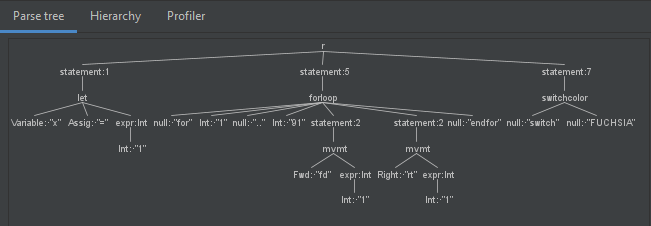
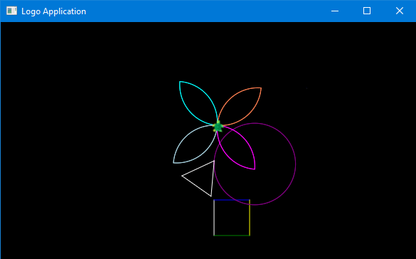

# LOGO-SAM

A mini-compiler for the LOGO graphical language

## Components:

- **Lexical Analysis:** tokenizing input streams such as *fd 50* , *for 1 .. 4 ~statements~ endfor***** 
- **Syntax Analysis:** Using Antlrv4 grammar to generate a parse tree and tree walker with Recursive Descent
- **Semantic Analysis:** Providing appropriate semantic actions such as checking variables from symbol table, switching with available colors.
- **Code Optimization:**  Generating Constant-Folding and Dead Code elimination for the code
- **Target Code Generation**: Generating the Drawing using GUI from JavaFX Graphics Context

## Sample Parse Tree Output:

## Sample Output:

